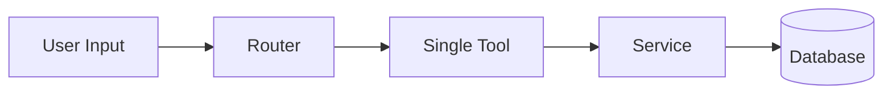
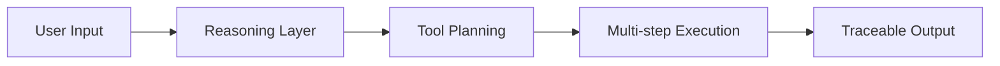

# V2 Architecture & Migration Plan

## Table of Contents

- [First: Lock V1 Properly](#first-lock-v1-properly)
- [What V2 Actually Is (in your system)](#what-v2-actually-is-in-your-system)
- [V2 Goal](#v2-goal)
- [V2 Architecture Shift](#v2-architecture-shift)
- [V2 Core Components (minimal but correct)](#v2-core-components-minimal-but-correct)
- [Suggested V2 Folder Evolution](#suggested-v2-folder-evolution)
- [V2 Rules (important)](#v2-rules-important)
- [Minimal V2 Implementation Order (VERY IMPORTANT)](#minimal-v2-implementation-order-very-important)
- [Mental Model Shift](#mental-model-shift)
- [Next Steps](#next-steps)

---

## First: Lock V1 Properly

**Do this before coding anything:**

```bash
git add .
git commit -m "chore: freeze V1 baseline before V2"
git tag v1.0.0
git push origin main
git push origin v1.0.0

## V2 Architecture Shift
Right now


v2

